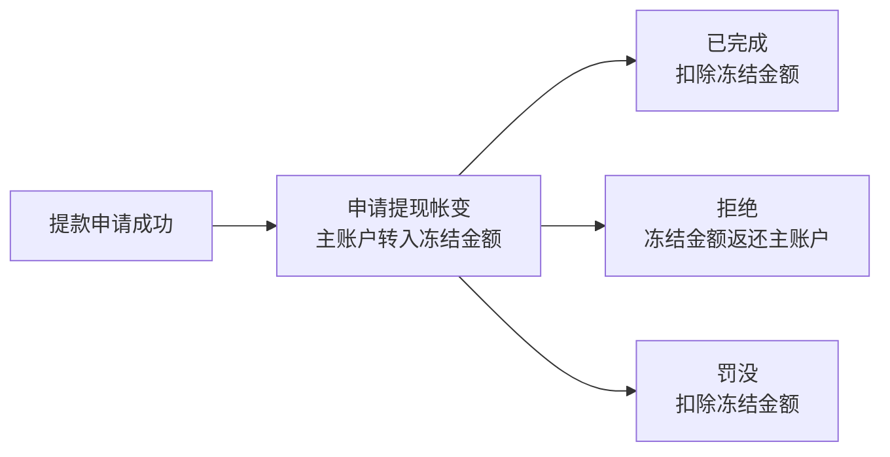

# 帐变记录—提款二次迭代 PRD

版本：V1.0｜日期：2026-10-01｜模块：会员管理 / 帐变记录

## 一、需求目标

将现有提款帐变的「会员提款、提款资金退回」两类记录，迭代为可完整追踪提款生命周期的四个二类：**申请提现、已完成、拒绝、罚没**。本期同时引入冻结金额，明确资金在会员主账户与冻结金额之间的流转，并在备注中记录各阶段发生时间。

## 二、已确认内容

| 一级类型 | 二级类型 | 英文（建议译名） | 葡萄牙语（建议译名） | 资金结果 |
|---|---|---|---|---|
| 提现 | 申请提现 | Withdrawal request | Solicitação de saque | 主账户扣款，冻结金额增加 |
| 提现 | 已完成 | Completed | Concluído | 冻结金额扣除，款项完成出款 |
| 提现 | 拒绝 | Rejected | Recusado | 冻结金额扣除，同额返还主账户 |
| 提现 | 罚没 | Forfeiture | Confisco | 冻结金额扣除，不返还主账户 |

### 2.1 类型替换

- 「会员提款」不再作为本期新产生记录的二级类型，改为「申请提现」与「已完成」。
- 「提款资金退回」不再作为本期新产生记录的二级类型，改为「拒绝」。
- 历史记录保留原类型与原备注，不做类型改写。

### 2.2 列表字段

在现有帐变记录列表中新增并使用「变动后冻结金额」字段；建议与现有「变动前金额、变动后金额」相邻展示。

| 字段 | 含义 | 展示规则 |
|---|---|---|
| 账变金额 | 本条记录所变动资金桶的金额，正数为增加、负数为扣除 | 保留两位小数；申请提现的冻结金额使用黑色，实际扣款使用红色，帐变增资使用绿色 |
| 变动前金额 / 变动后金额 | 会员主账户可用余额 | 申请、拒绝会发生变化；已完成、罚没保持申请后的主账户余额 |
| 变动后冻结金额 | 当前记录完成后的会员冻结金额 | 四类提款帐变均展示；无冻结金额历史数据以 `-` 展示 |
| 来源 ID | 对应提款申请单 ID | 同一提款生命周期的四类记录使用同一来源 ID |

## 三、资金与帐变规则

设提款金额为 A；申请前主账户可用余额为 M；申请前冻结金额为 F。

| 阶段 | 生成帐变 | 主账户余额 | 冻结金额 | 账变金额 | 记录前提 |
|---|---|---:|---:|---:|---|
| 申请提现 | 申请提现 | `M → M-A` | `F → F+A` | `-A` | 申请成功且可用余额足够 |
| 出款完成 | 已完成 | `M-A → M-A` | `F+A → F` | `-A` | 同一申请未产生终态帐变 |
| 审核拒绝 | 拒绝 | `M-A → M` | `F+A → F` | `+A` | 同一申请未产生终态帐变 |
| 审核罚没 | 罚没 | `M-A → M-A` | `F+A → F` | `-A` | 同一申请未产生终态帐变 |

### 3.1 帐变金额颜色规则

| 二级类型 | 金额性质 | 字体颜色 |
|---|---|---|
| 申请提现 | 主账户金额转入冻结金额，不代表实际扣款 | 黑色 |
| 已完成、罚没 | 冻结金额实际扣除 | 红色 |
| 拒绝 | 冻结金额返还主账户，属于帐变增资 | 绿色 |

金额正负号不单独决定颜色；以资金性质为准。

### 3.2 状态闭环

- 「已完成、拒绝、罚没」为互斥终态；同一提款申请只能生成其中一条终态帐变。
- 已生成终态帐变后，重复回调、重复审核或人工重复操作不得再次扣减或返还资金。
- 申请失败、主账户余额不足时，不生成任何提款帐变，也不改变冻结金额。
- 本期不新增“撤销申请”类型；该场景如后续需要支持，须单独定义资金回退与备注规则。

## 四、备注规则

所有时间按帐变记录页面当前时区展示；格式为 `YYYY-MM-DD HH:mm:ss`。备注字段按以下规则拼接，不新增未确认的固定前缀。

| 二级类型 | 备注内容 |
|---|---|
| 申请提现 | `申请提现时间：{申请时间}`。产生终态后，回写追加：`；最终状态：{已完成/拒绝/罚没}；{完成/拒绝/罚没}时间：{终态时间}；终态帐变ID：{终态帐变ID}` |
| 已完成 | `提现申请帐变ID：{申请帐变ID}；申请提现时间：{申请时间}；完成时间：{完成时间}` |
| 拒绝 | `提现申请帐变ID：{申请帐变ID}；申请提现时间：{申请时间}；拒绝时间：{拒绝时间}；{系统审核拒绝原因或人工拒绝备注}` |
| 罚没 | `提现申请帐变ID：{申请帐变ID}；申请提现时间：{申请时间}；罚没时间：{罚没时间}；罚没备注：{罚没备注}` |

规则说明：

- 「申请提现」在申请成功时先写入申请时间；终态产生后，补齐终态名称、终态时间和终态帐变 ID，便于从申请记录直接追踪结果。
- 拒绝原因优先读取系统审核拒绝原因；无系统原因时读取人工拒绝备注。两者均为空时不拼接占位文本。
- 罚没备注来源于实际罚没操作备注；为空时不拼接占位文本。

## 五、查询、权限与历史兼容

| 项目 | 规则 |
|---|---|
| 类型筛选 | 提现一级下展示四个新二级类型；历史「会员提款、提款资金退回」仍可按历史类型查询 |
| 会员 ID 查询 | 输入会员 ID 后返回该会员的主账户与冻结金额变化记录，用于上下游核对 |
| 订单关联 | 同一来源 ID 下可查询申请帐变与唯一一条终态帐变 |
| 导出 | 导出字段包含变动后冻结金额、来源 ID、备注及记录时间 |
| 权限 | 沿用帐变记录查询、导出权限；本期不在帐变页新增人工资金处理入口 |
| 操作日志 | 提款审核、拒绝、罚没等原业务操作继续记录至对应业务操作日志；帐变页仅展示结果，不提供修改、删除或补录 |

## 六、待确认事项

以下项目未在本次需求中明确，不作为已确认实现规则：

| 事项 | 影响 |
|---|---|
| 冻结金额的数据库字段名、接口字段名及历史数据补齐方案 | 前后端联调与历史列表展示 |
| 提款手续费、实际出款金额与申请金额不一致时的账变拆分 | 账变金额、冻结金额及备注口径 |
| 提现申请取消场景 | 是否生成独立帐变类型与释放冻结金额 |
| 已完成后发生三方退回或冲正 | 是否使用现有资金退回逻辑或新增终态类型 |
| 终态回写申请备注的技术实现时机 | 消息回调与事务一致性 |
